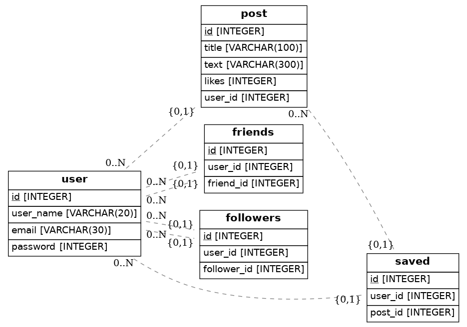

# Create the database model for Instagram

## 💻 Instalación

1. Entra dentro del environmen `$ pipenv shell`

2. Instala todas las dependencias `$ pipenv install`

3. Genera el diagrama tantas veces como sea necesario `$ python src/models.py`

4. Abre el archivo `diagram.png` para ver tu diagrama UML!

## 📝Instrucciones

Tu trabajo es actualizar el archivo `src/models.py` con el código necesario para replicar el modelo de datos de instagram.

El proyecto está utilizando la librería Python SQLAlchemy para generar la base de datos.

- Qué tablas crees que puede tener instagram en su base de datos: Por ejemplo Post, Usuario, etc.?
- ¿Qué propiedades deberían ir dentro del usuario? o dentro de la tabla Post?
- Por favor, añade al menos 4 modelos con todas sus propiedades.
- Genera el archivo diagram.png al final ejecutando `$ python3 models.py` en la consola.

## ⭐Sobre el proyecto

Finalmente he creado 5 tablas que son:
- Usuarios
- Post
- Amigos
- Seguidores
- Guardados

